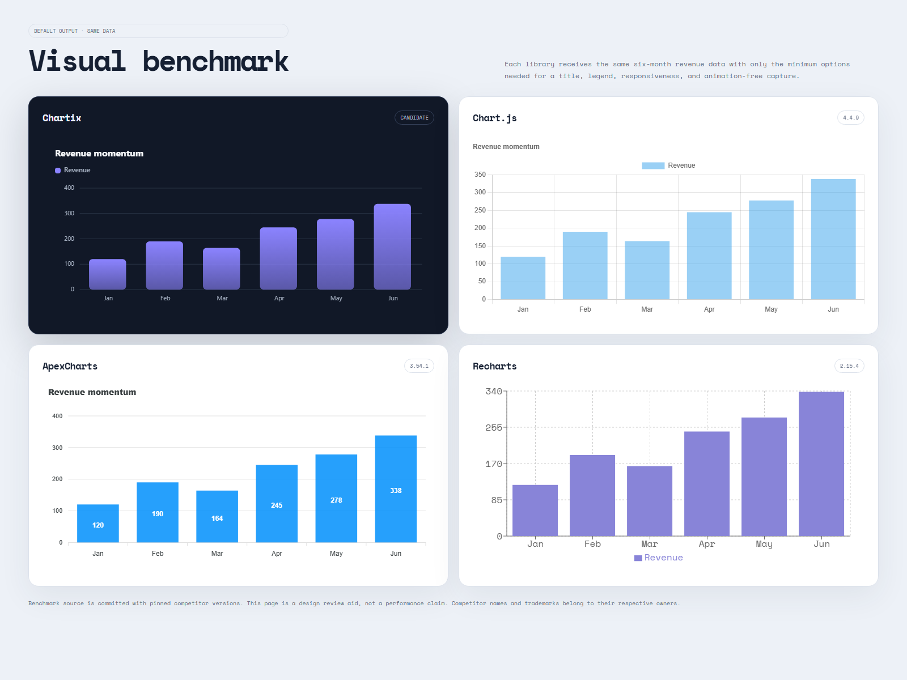

# Visual benchmarks

This folder keeps Chartix's visual quality review reproducible instead of relying on memory or
marketing claims. The live page renders the same revenue dataset using Chartix, Chart.js 4.4.9,
ApexCharts 3.54.1, and Recharts 2.15.4. Competitor versions are pinned and animations are disabled
for a stable comparison.

The image was captured from the deployed benchmark at 1600 × 1200. It is a subjective design-review
aid, not a performance benchmark. Each library receives its normal default styling with only the
minimum configuration needed for equivalent data, responsiveness, title/legend context, and an
animation-free screenshot.

Live benchmark: <https://freber6684.github.io/Chartix/examples/benchmarks/>
